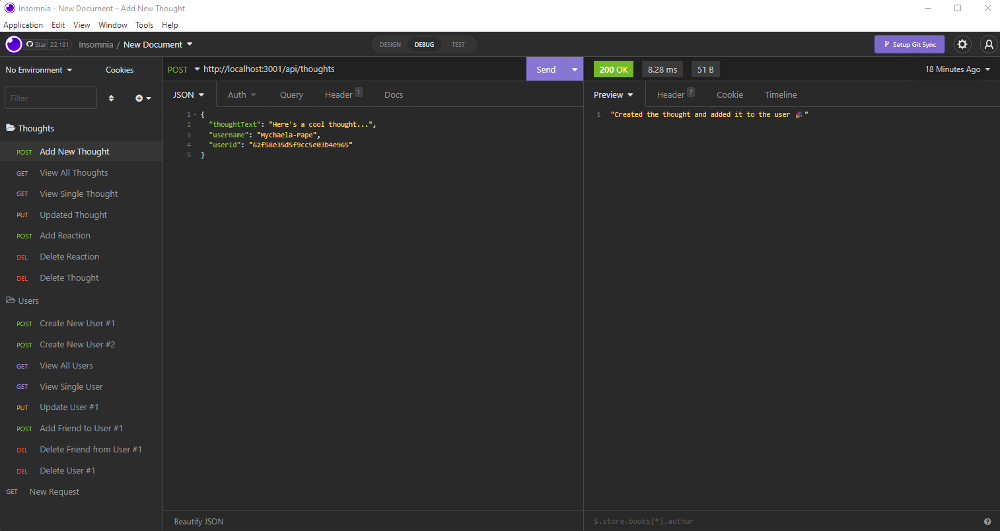

# Social-Network-API

Project Description: In this application I've built an API for the a social network web application where users can share their thoughts, react to friends thoughts and create a friends list. This is done through GET, POST, PUT and DELETE routes. My application uses Express.js for routing, MongoDB for the database and the Mongoose ODM. This application has not been deployed so I've created a walkthrough video of the routes being tested through Insomnia. 
 
GitHub Link: https://github.com/RPAPE3/Social-Network-API 

Walkthough Link: https://drive.google.com/file/d/1UehBFeQ2UCKtFsOHkY48ybGj961VerbH/view 

Screenshots: 
